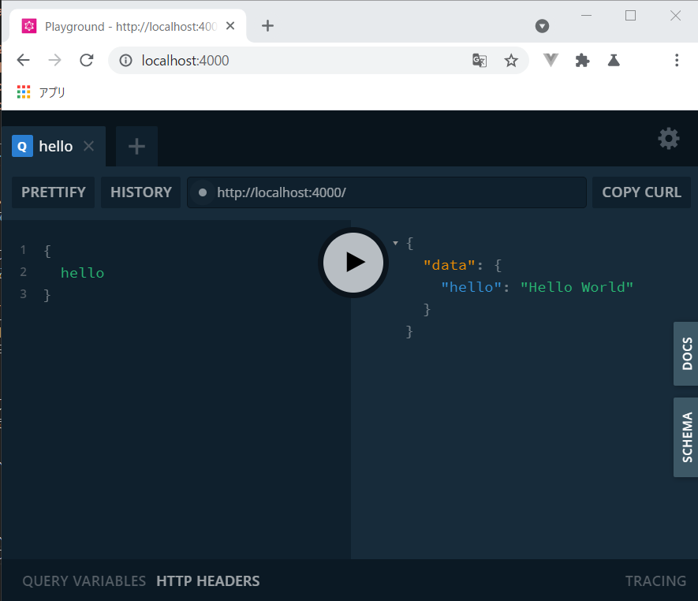

# graphql-yoga🧘を使ってみる

なかなかGraphQLに慣れない。GraphQLを手軽に操作検証できるように、勉強がてらNode.js環境でローカルサーバを立てます。

サーバーライブラリーはいくつかありますが、シンプルそうだったのでまずは`GraphQL-yoga`を使用してみたいと思います。

おおむね[こちら](https://github.com/prisma-labs/graphql-yoga)のページを参考にしました。今回はgraphql-yogaでサーバーを立て、queryでデータを取得するところまでやります。クライアントはGraphql-yogaについてくるGraphQL Playgroundというのを使います。

肝心のデータですが、いきなりDBに接続するのはハードルが高いので、サーバースクリプトにオブジェクト形式で記述した値を取得することにしたいと思います。

しばらくはこの形式でGraphQLをいろいろ触ってみて、そのあとMongoDBに接続してデータ取得などを行いたいと思います。

<aside>

**入門**と銘打っていますが、このシリーズ自体が**完全に見切り発射**ですので、順番通りではなく必要な所だけかいつまんで読んでください。

</aside>

## 環境

```shell
$ node -v
v14.15.4

$ yarn -v
1.22.5
```

## まずは最小構成

`yarn init -y`して、サーバライブラリの`graphql-yoga`をインストールします。

```shell
$ yarn init -y

$ yarn add graphql-yoga

$ cat package.json
{
  ...(略)
  "dependencies": {
    "graphql-yoga": "^1.18.3"
  }
}
```

ルートディレクトリに`index.js`を作成、以下の通りに記述します。最小構成という事で、"Hello World"と返すだけのhelloクエリを定義しています。

```javascript:title="index.js"
const { GraphQLServer } = require("graphql-yoga");

// スキーマを定義
const typeDefs = `
  type Query {
    hello: String!
  }
`
const resolvers = {
  Query: {
    // helloクエリ
    hello: () => `Hello World`
  }
}

const server = new GraphQLServer({typeDefs, resolvers});

server.start(() => {
  console.log('Server is running on localhost:4000');
})
```

`typeDefs`にスキーマを定義します。

データを取得する`Query`クエリについて`hello`というクエリを定義します。`hello: String!`はhelloクエリが必ずString型の値を返すことを意味しています（!はnullにならないという意味）。

`resolvers`はどんなクエリにどんな値を返すかを定義します。スキーマ情報とリゾルバは、インスタンス生成する時の必須の引数です。

---

では、サーバを起動します。

```shell
$ node index.js

Server is running on localhost:4000
```

`http://localhost:4000`にアクセスすると、GraphQL Playgroundが現れます（かっこいいですね）。簡易的なクライアントとして使用でき、様々なクエリを投げることができます。


左上のペインに以下の`hello`クエリを入力し、画面真ん中の三角ボタンをクリックします。

```graphql:title="Playground"
  {
    hello
  }
```

以下のような形で**Hello World**が返されたら成功です。



## 引数付きのクエリを作成する

さすがにもう少し凝ったことをしたいので、先ほどのhelloクエリを編集し、
「自分の名前を渡し、`Hello 名前`と返ってくる」ようにしたいと思います。
引数名はnameとし、String型を指定、末尾に`!`をつけて必須にします。

```javascript{3,5}
...

const typeDefs = `
  type Query {
    # 必須の引数にString型のname、戻り値も必須でString型
    hello(name: String!): String!
  }
`

const resolvers = {
  Query: {
    hello: (_, {name}) => {
      `Hello ${ name }`
    }
  }
}

...
```

```graphql
  query {
    hello(name: "kento")
  }

  # result
  {
    "data": {
      "hello": "Hello kento"
    }
  }
```

## 引数を増やす

年齢を格納する数値型のageフィールドを追加します。

```javascript
...

const typeDefs = `
  type Query {
    // ageを追加
    hello(name: String!, age: Int!): String!
  }
`

const resolvers = {
  Query: {
    hello: (_, {name, age}) =>
      `I\'m ${name}. ${age} years old.`
  }
}

...
```

クエリは以下のように投げます。

```graphql
  query {
    hello(name: "kento", age: 33)
  }

  # result
  {
    "data": {
      "hello": "I'm kento. 33 years old."
    }
  }
```

---

渡した値は第二引数にオブジェクト形式で入るらしいので試しにダンプしてみます。

```javascript
...(略)

const typeDefs = `
  type Query {
    # [データ型]で、戻り値を配列に設定
    hello(name: String!, age: Int!): [String]!
  }
`

// プロパティを取得
const resolvers = {
  Query: {
    hello: (_, args) => {

      let result = [];

      Object.keys(args).map(arg => {
        result.push(arg)
      })

      return result
    }
  }
}

...(略)
```

```json:GraphQL Playground
query {
	hello(name: "kento", age: 33)
}

 # result
  {
    "data": {
      "hello": [
        "name",
        "age"
      ]
    }
  }
```

よって、以下のような取り出し方もできます（これはJavaScriptのオブジェクトの扱いの話ですね）。

```javascript
// 分割代入で受け取るか、
hello: (_, {name, age}) => `Hello ${ name }. `)

// argsでまとめて受け取り、nameキーにアクセスして受け取る
hello: (_, args) => `Hello ${ args.name }`)
```

## クエリを投げてデータを取得する

いよいよクエリからデータを取得してみたいと思います。DBに接続してクエリを投げて、、、と行きたいですが、まずは`index.js`にデータをハードコートして、それを取得してみます。

まず、データをオブジェクト形式で定義します。適当にpersonalDataなどとします。

```javascript
const personalData = [
  {
    id: 1,
    name: "kento"
  },
  {
    id: 2,
    name: "hikari"
  }
]
```

次にスキーマを定義します。

```javascript
const typeDefs = `
  type Data {
    id: Int,
    name: String,
  }
  type Query {
    data: [Data]
  }
`
```

以下のようなスクリプトを用意します。

```javascript
const { GraphQLServer } = require("graphql-yoga");

const personalData = [
  {
    id: 1,
    name: "kento"
  },
  {
    id: 2,
    name: "hikari"
  },
  {
    id: 3,
    name: "hiroshi"
  },
  {
    id: 4,
    name: "ayaka"
  },
]

const typeDefs = `
  type Data {
    id: Int,
    name: String,
  }
  type Query {
    data: [Data]
  }
`
const resolvers = {
  Query: {
    data: () => personalData
  }
}

const server = new GraphQLServer({ typeDefs, resolvers });

server.start(() => {
  console.log('Server is running on localhost:4000');
})
```

これまでと同じように`localhost:4000`にアクセスして、GraphQL Playgroudを開きます。

クエリは以下のように投げます。

```graphql
query {
  data {
    id,
    name
  }
}

# result
{
  "data": {
    "data": [
      {
        "id": 1,
        "name": "kento"
      },
      {
        "id": 2,
        "name": "hikari"
      },
      {
        "id": 3,
        "name": "hiroshi"
      },
      {
        "id": 4,
        "name": "ayaka"
      }
    ]
  }
}
```

見事！データを取得できました。

今回はここまでにしたいと思います。次回はMongoDBを用意してDBからデータを取得する方法を考えたいと思います。

# 参考

[prisma-labs/graphql-yoga](https://github.com/prisma-labs/graphql-yoga)

[graphql-yoga/index.js at master · prisma-labs/graphql-yoga](https://github.com/prisma-labs/graphql-yoga/blob/master/examples/fullstack/server/index.js)

[Resolvers - Apollo Server - Apollo GraphQL Docs](https://www.apollographql.com/docs/apollo-server/data/resolvers/)

https://apollographql-jp.com/tutorial/resolvers/


https://medium.com/@gbolahanolawuyi/setting-up-a-graphql-server-with-node-graphql-yoga-prisma-a3f59d33dac0

[How To Build a GraphQL Server in Node.js Using GraphQL-yoga and MongoDB | DigitalOcean](https://www.digitalocean.com/community/tutorials/how-to-build-a-graphql-server-in-node-js-using-graphql-yoga-and-mongodb)
