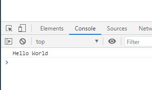
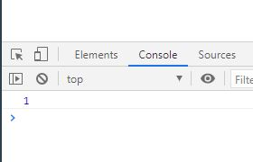

# 初めてのJavaScriptコード

## ブラウザのコンソールに文字を出力する

以下のようなhtmlファイルを用意します。

```html
<!DOCTYPE html>
<html lang="ja">
<head>
  <meta charset="UTF-8">
  <meta name="viewport" content="width=device-width, initial-scale=1.0">
  <title>入門JavaScript</title>
</head>
<body>
  <script src="script.js"></script>
</body>
</html>
```

ポイントはbodyの中の`<script>`タグです。htmlファイルでは`<script>`タグを用い、JavaScriptを利用します。`src=[path]`の記述でJavaScriptファイルを読み込みます。
それではindex.htmlと同じ階層に`script.js`ファイルを用意し、以下のように記述してください。

```javascript
console.log('Hello World');
```

文はセミコロンによって区切られます。行末尾のセミコロンは忘れずに付けるようにしましょう。セミコロンをつけなくてもJavaScriptは自動的に保管してくれるようですが、それは時に思わぬ不具合をもたらします。

以上で準備完了です。index.htmlをダブルクリックしてGoogle Chromeを立ち上げるか、VSCodeを使用している方ならLive Serverプラグインが便利です。

ブラウザを立ち上げても、画面上には何も表示されていないはずです。`cosnoel.log`という命令の結果は、ブラウザのコンソールに出力されます。F12キーを押下し、開発者ツールを開いてください。そしてConsoleタブがあるはずですので、クリックします。



`Hello World`と表示されていたならOKです。今回の解説は終了です。

しばらくの間はこのようにGoogle Chromeのブラウザコンソールに出力して結果を確認したいと思います。

本当はNode.jsをインストールすればもっと簡潔に実行できますがよくわからないものを入れたくないと思いますので、後回しにします。

## 変数を表示させる

 - const [ES2015]
 - let [ES2015]

変数はよく、箱にたとえられます。箱に好きな名前をつけ、好きな数値や文字列を収納、好きな時に引っ張り出して使いまわすことができます。

JavaScriptにおいて変数はconstキーワード、のちに紹介するletキーワードを使用して定義します。

以下の例では、constキーワードを使用し、`age`という名前の変数を宣言、数字の1をage変数に代入しています。

```javascript

const 変数名 = 値;

// 変数ageに数字の1を代入
const age = 1;
```

変数に代入した値を利用する時は、以下のように変数名を記述します。

```javascript
const age = 1;

// 変数ageの値を出力
console.log(age)
```



なお、これより、コンソール上に出力されるメッセージは`// => 出力結果`という形で記載します。

```javascript
const age = 1;

console.log(age)
// => 1
```

変数には文字列も格納することができます。文字列を表現する時はシングルクオート、またはダブルクオートを用います。

```javascript
const name1 = "kento";
const name2 = 'keiko';

console.log(name1);
// => kento

console.log(name2);
// => keiko
```

## 変数を宣言するタイミングは？

変数は、その変数を利用する文（上記例で言うとconsole.log()のところ）よりも前に宣言する必要があります。宣言する前に変数を使用すると、以下のようにエラーが出力されます。

```javascript
console.log(age);
// => Uncaught ReferenceError: Cannot access 'age' before initialization

const age = 1;
```

訳すと、「変数ageには初期化する前にはアクセスできないよー」となります。また詳しく取り上げますが、変数の宣言と初期化に関しては、以下のリンクに簡潔にまとめられています。
[JavaScriptの変数巻き上げという概念](https://qiita.com/hi_zacky/items/2309f0ba6092101ca70e)

## constとletの違い

constを使用して変数に値を代入した場合、後から他の値を代入することはできません。
実際に代入しようとすると、エラーが出力されます。変数の値を上書きするようなことはできないという訳です。

```javascript
const age = 1;

// 再度代入しようとしている
age = 2;
// => Uncaught TypeError: Assignment to constant variable.
```

再代入する可能性がある変数を宣言する時は、letキーワードを用います。

```javascript

let name = "kento";

// 再代入できる
name = "keiko";

console.log(name);
// => keiko
```

constとletはどちらかに優劣が付くものではありません。letは後から値を書き換えられるため便利そうですが、「意図しないところで勝手に値が下記変わってしまう可能性がある」とも言えます。

変数宣言は基本的にconstを用い、再代入が必要な時だけletを使用する、と憶えておけば間違いないと思います。

## 式と文
